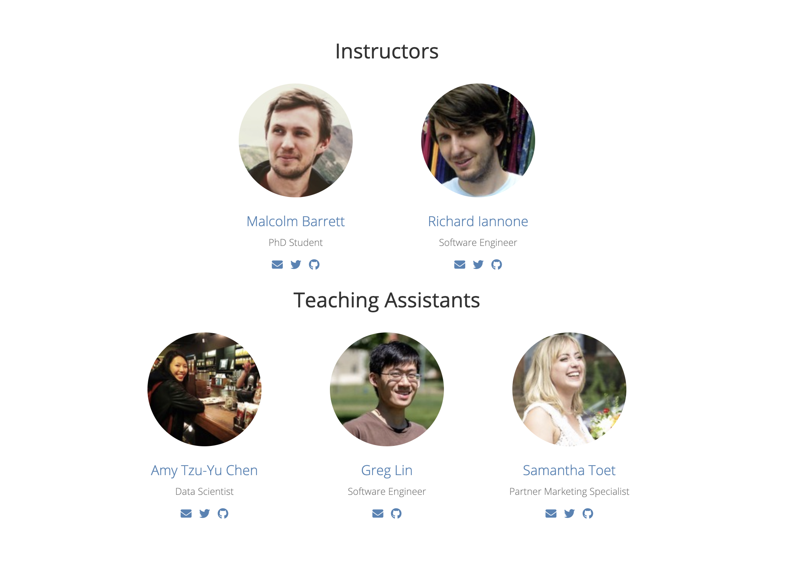
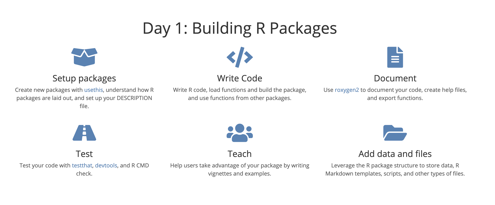
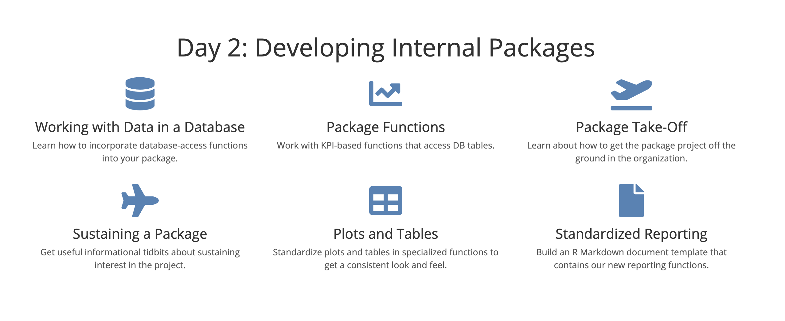
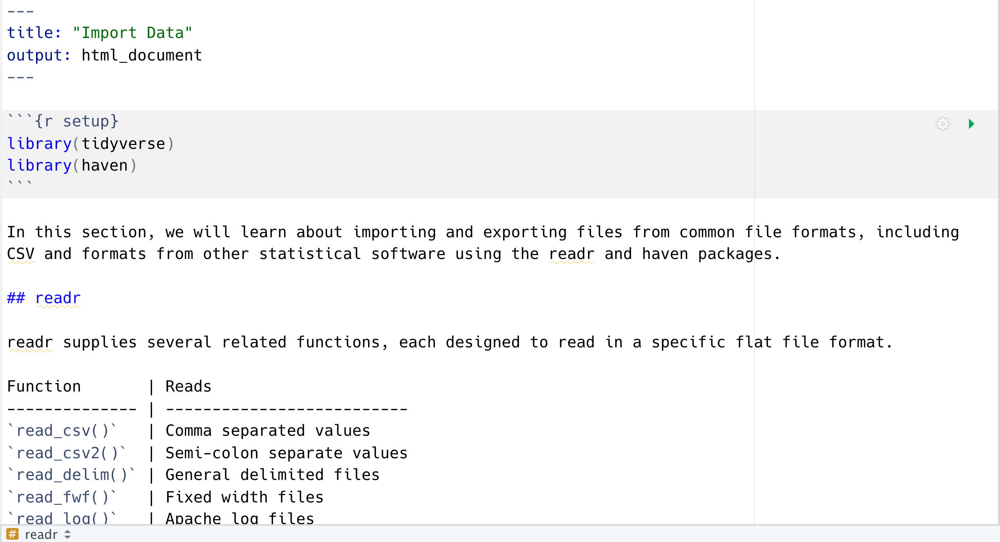
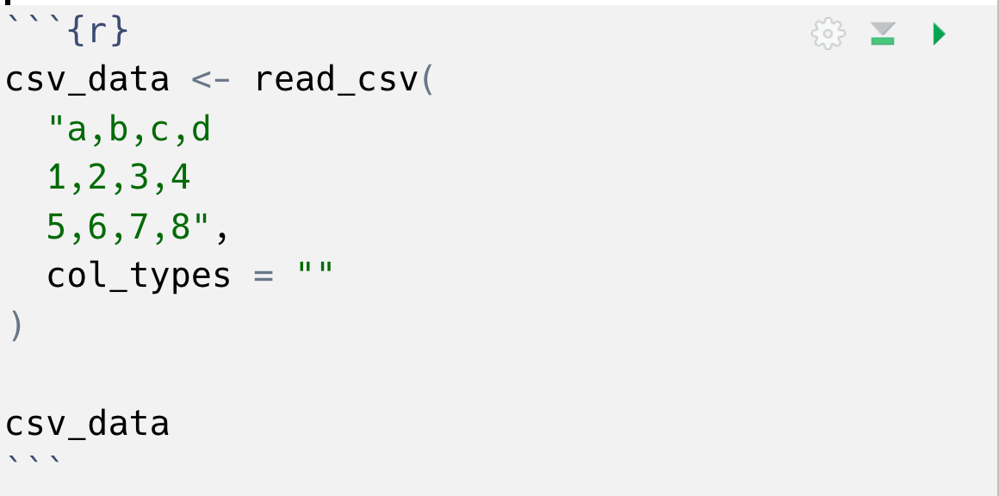

background-image: url(https://i.imgur.com/CVIZGyY.jpg)
background-position: top
background-size: 100%
class: inverse, shadow

```{r setup, include=FALSE}
options(htmltools.dir.version = FALSE)
knitr::opts_chunk$set(warning = FALSE, message = FALSE, fig.align = "center", dpi = 320)
library(tidyverse)
```


```{r, css_theme, echo=FALSE}
htmltools::includeCSS("https://raw.githubusercontent.com/malcolmbarrett/kakashi/master/kakashi.css")
```

# My Organization's First R package
## Welcome!
## `rstudio::conf(2020L)`

---

class: inverse, center, middle

# **In R, the fundamental unit of shareable code is the package.**
.pull-right[—Hadley Wickham]

---

class: middle, center

# Who are we

```{r, out.height="90%", out.width="90%", echo = FALSE}

```

---

# Why use internal R packages?

--

## Share code

--

## Standardize your workflow

--

## Save time!!!!

---

# Community examples

## ["How R helps Airbnb make the most of its data"](https://peerj.com/preprints/3182/)

--

## ["How the BBC Visual and Data Journalism team works with graphics in R"](https://medium.com/bbc-visual-and-data-journalism/how-the-bbc-visual-and-data-journalism-team-works-with-graphics-in-r-ed0b35693535)

--

## ["Building an R community at the Urban Institute"](https://medium.com/@urban_institute/building-an-r-community-at-the-urban-institute-b66739aaaaa7)

--

## For more examples and patterns, check out ["Resource Round-Up: R in Industry Edition"](https://emilyriederer.netlify.com/post/resource-roundup-r-in-industry-edition/) by Emily Riederer

---

class: center, middle

```{r, out.height="90%", out.width="90%", echo = FALSE}

```

---

class: center, middle

```{r, out.height="90%", out.width="90%", echo = FALSE}

```

---

class: inverse, center, middle
# **This course is hands on!**
# Each section has an exercises file: **`exercises.Rmd`**

---

# exercises.Rmd

```{r, out.height="100%", out.width="100%", echo = FALSE}

```

---

# code chunks

```{r, out.height="75%", out.width="75%", echo = FALSE}

```

---

# Project contents

If you're on local:

```
├── materials
    ├── day1/
    └── day2/
```

In each module:

```
├── 01-setup
    ├── 01_avalanchr.Rproj
    ├── DESCRIPTION
    ├── NAMESPACE
    ├── R/
    ├── exercises.Rmd
    └── slides.pdf
```

---

## Your Turn 1

## Introduce yourself to your neighbors. We have lots of people to help you out today, but the person sitting next to you might be your best resource!


